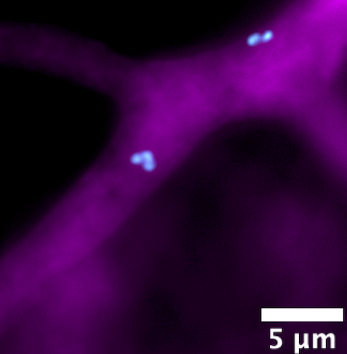

# BFIBundle

The purpose of this library is to help users interact with the bacterial-fungal-interactions database, found on the [BFI Research Portal](https://sfa-bfi.edgebioinformatics.org/about) interact with the data programatically. This is a lightweight wrapper around a few api endpoints. The package also has a few helper functions to link up doi's and quick search papers.


## Description

The goal of the Chain SFA is to close the knowledge gaps when it comes to studying BFI. The current database houses 6049 bfi pairs.

Cool photo of MRE:



## Getting Started

### Installing

```pip install bfibundle```


Or via docker:

```docker pull mbabinski17/bfibundle```

### BFIBundle

Check out demo [here](demo/demo.ipynp) as a jupyter notebook.

For more feature requests, please make a PR. 

## Authors

```
Aaron Robinson LANL Scientist arobin@lanl.gov
Michal Babinski LANL Computational Biologist mbabinski@lanl.gov
```


## Version History

* 0.1.0
    * Initial Release

## License

This project is licensed under the MIT License - see the LICENSE.md file for details
